# 💸 OmarFinance

OmarFinance is a lightweight, full-stack fintech prototype that includes:

- 🎨 A React-based frontend (loan generator)
- ☁️ A serverless backend deployed with AWS (DynamoDB, Lambda, API Gateway)
- ⚙️ Infrastructure managed via Terraform
- 🚀 Frontend CI/CD via AWS Amplify Console (GitHub)

---

## 📁 Folder Structure

```
.
├── react-loan-app/     # Frontend React application
│   └── README.md
├── tf-loan-app/              # Terraform backend infrastructure
│   └── README.md
├── assets/             # Screenshots and deployment references
└── README.md           # You're here
```

---

## ⚙️ Terraform Backend Deployment

All backend infrastructure (API Gateway, Lambda, DynamoDB, and Terraform remote state) is defined in the [`tf-loan-app/`](./tf-loan-app/) folder.

### Steps:

```bash
cd tf-loan-app/init
terraform init
terraform apply
# copy the generated bucket name and update ../backend.tf
```

Then:

```bash
cd ../lambda
npm install
zip -r ../lambda.zip .
cd ..
terraform init
terraform apply
# copy the generated api gateway URL `e.g https://abc123.execute-api.us-east-1.amazonaws.com`

```
You can optionally enable CORS for the API Gateway via the AWS Console for added security
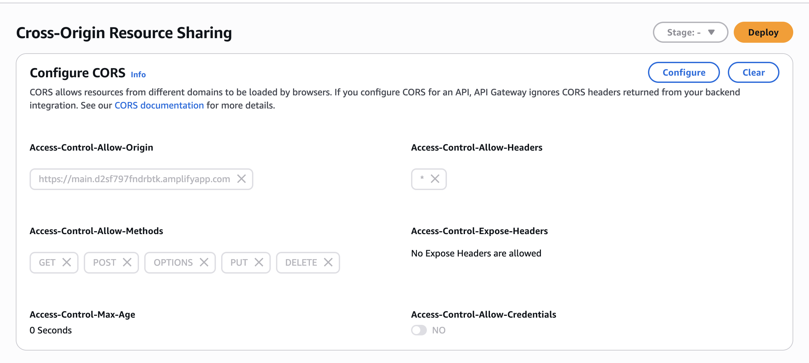


📖 See [`tf-loan-app/README.md`](./tf-loan-app/README.md) for full instructions.

---


## 🚀 Amplify Deployment Guide (Step-by-Step)

> You can find the referenced screenshots in the `assets/` folder.

---

### ✅ 1. Go to AWS Amplify Console

Visit [https://console.aws.amazon.com/amplify](https://console.aws.amazon.com/amplify)

- Click **“Deploy an app”**

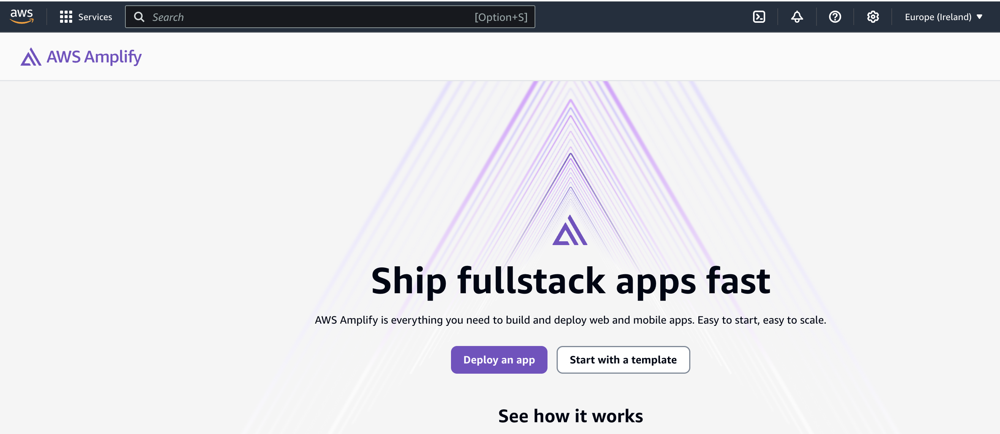

---

### ✅ 2. Select GitHub as Source Provider

- Choose **GitHub**
- Click **Continue** to authorize

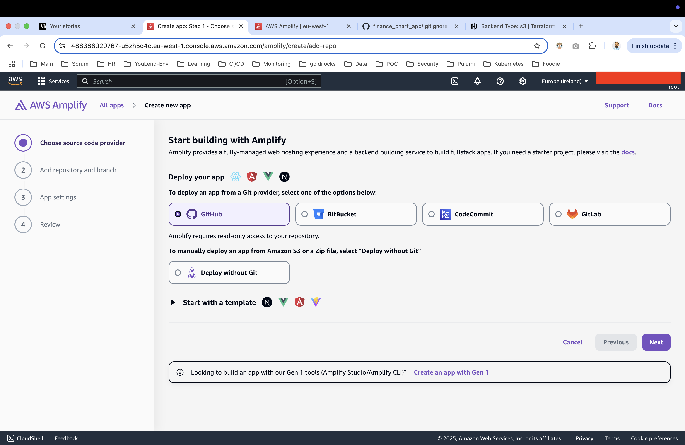

---

### ✅ 3. Authorize GitHub Repo

- Select your GitHub user/org
- Choose **Only Select Repositories**
- Pick `OmarFinance`

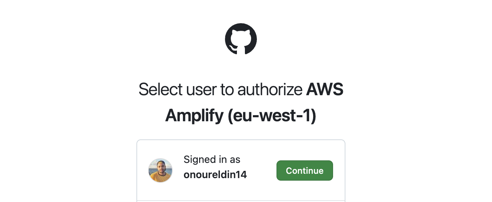
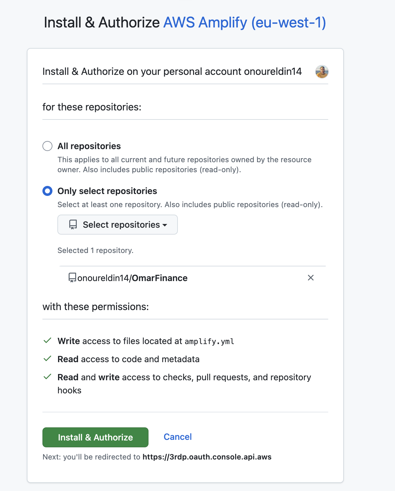
---

### ✅ 4. Select Repo & Enable Monorepo Mode

- Choose branch (e.g. `main`)
- Enable **“My app is a monorepo”**
- Set **monorepo root** to:
  ```
  react-loan-app
  ```

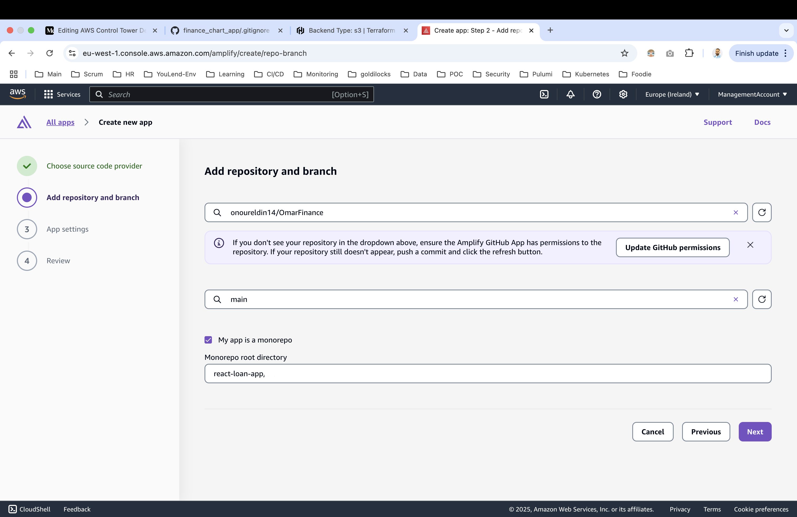

---

### ✅ 5. Configure App Build Settings

Set:

- **Frontend build command**: `npm run build`
- **Build output directory**: `build`

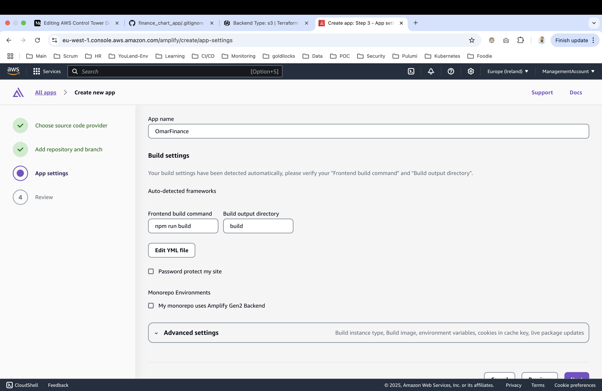

---

### ✅ 6. (Optional) Use `amplify.yml` for Build Config

Click **Edit YML file** and use:


```yaml
version: 1
applications:
  - frontend:
      phases:
        preBuild:
          commands:
            - npm ci --cache .npm --prefer-offline
        build:
          commands:
            - npm run build
      artifacts:
        baseDirectory: build
        files:
          - '**/*'
      cache:
        paths:
          - .npm/**/*
    appRoot: react-loan-app
```

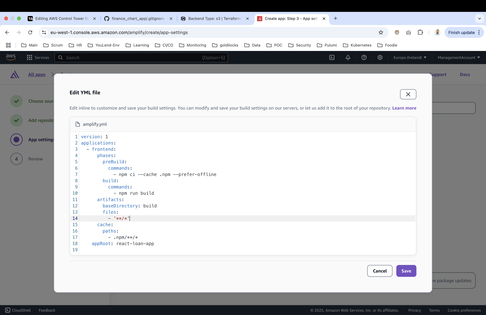

---
### ✅ 7. Add React App Enviornment Variable

Click **Advanced Settings** and scroll to **Environment variables**:


Set:

- **AMPLIFY_DIFF_DEPLOY**: `false`
- **AMPLIFY_MONOREPO_APP_ROOT**: `react-loan-app`
- **REACT_APP_API_URL**: `https://your-api-id.execute-api.region.amazonaws.com` # Replace with Terraform API GW Output

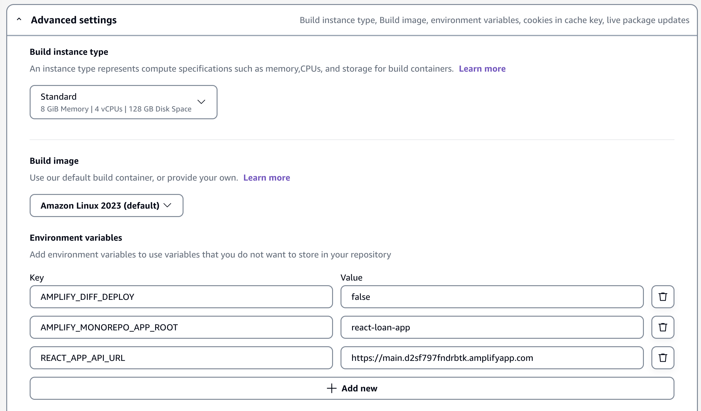

---

### ✅ 8. Review and Deploy

- Confirm settings
- Click **Deploy**

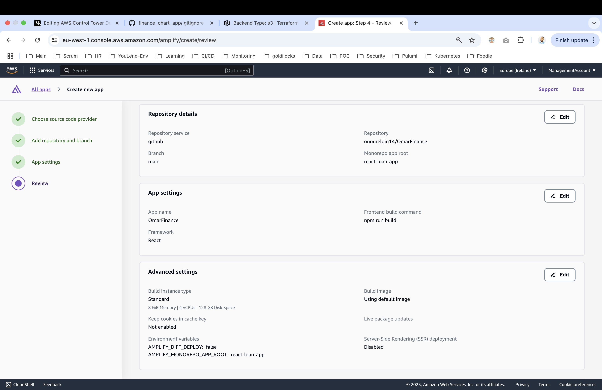
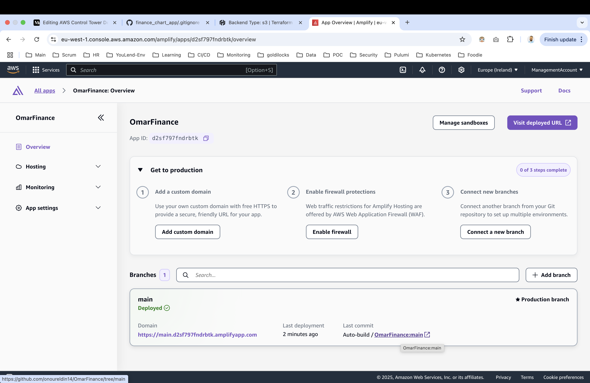

---

## 📦 Frontend React App

- All app source lives in [`react-loan-app/`](./react-loan-app)
- Uses **Create React App**
- Deploys via Amplify Console
- See [`react-loan-app/README.md`](./react-loan-app/README.md)

---

## 📸 App Demo (if available)

> Replace this with your GIF filename if needed.

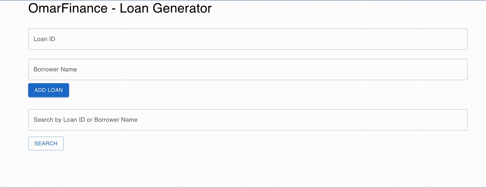

---

## 📄 License

MIT © 2025 Omar Din
